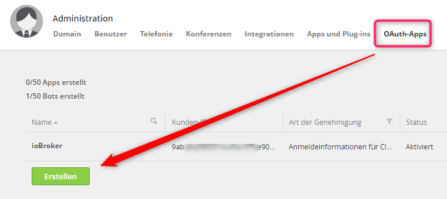
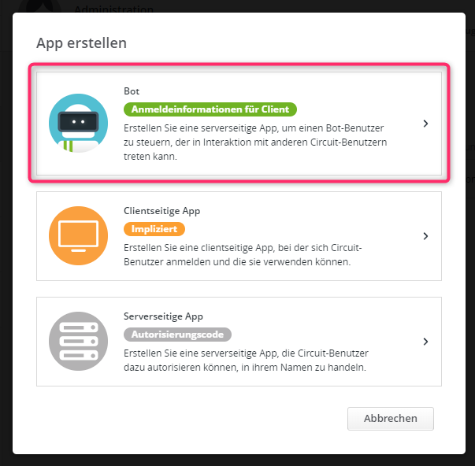
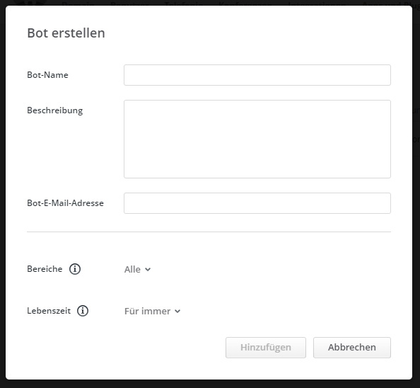
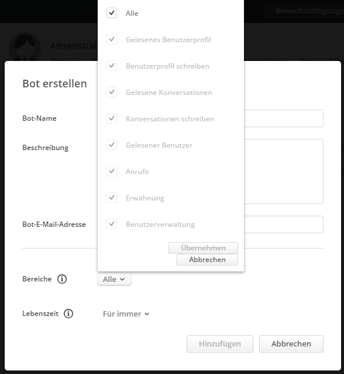

# ioBroker Unify Circuit Adapter


  
Der ioBroker Circuit Adapter dient zur Anbindung von der Unify Cloud Kollaboration Lösung Circuit an ioBroker, z.B. zur Erstellung eines Bots.

ioBroker stellt dabei die Middleware da, um Circuit z.B. Zugriff auf:

- History, SQL Anbindung
- Scriptengines, wie- JavaScript, Blockly
- IoT/Smarthome Daten und Steuerung

zu ermöglichen.

## Weitere Dokumentation zum Adapter

- [sendTo() API Aufrufe](./docs/sendto-api-aufrufe.md)
- [Dokumentation der internen Variablen des Circuit Adapters](./docs/myvars.md)

## Anwendungsfälle

- Erstellung eines Bots für Circuit mit dem Zugang zu allen Möglichkeiten von ioBroker
- Dokumentation von Änderungen in Posts/Items
- Spielumgebung, um die Circuit API kennenzulernen

### Ideen für Scripte

...oder als Erweiterung für den Adapter, bzw. korospondierende Adapter:

- Rückmeldung an Anwender, das sein angeschriebener Teilnehmer schon länger nicht mehr online war, ggf. Parallesignaliserung des Angeschriebenen über andere Medienwege (Anruf, Email, ...)
- Haussteuerung über Circuit durch die Anbindung an ioBroker
- Abbildung von Eskalationsstufen (keine Antwort, andere Kanäle, andere Teilnehmer direkt angesprochen, Quittierung, usw.)
- Automatischer Support-Bot (Knowledgebase)
- Übergabe von Präsenzinformationen in VIS
- Anwender-Newsticker in VIS (Anwender schreiben in eine Circuit Konversation und auf zentralen Bildschirmen werden die Nachrichten über VIS dargestellt)
- Steuerung von Servicetechnikern (Meldung vom IoT Gerät an ioBroker, Benachrichtigung und Eskalation der Techniker über Circuit)
- Automatische Umwandlung und Auswertung von Dateien. Z.B. Ablage eines Teil-REGENs einer OpenScape 4000 in Circuit, parsen und Auswertung über ein Skript auf ioBroker, Rückmeldung des Ergebnis über Circuit
- Eine Konversation in ein PDF umwandeln und ablegen
- Konversationen gegen das (versehentliche) Hinzufügen von Externen schützen
- Konversationen geschützter interner Teilnehmerkreis
- Wiedervorlag von Konversationen nach X Tagen oder zu einem Datum
- User, die sich das erste Mal anmelden Willkommen heissen (in neuer Direktkonversation 1:1 und als Info an alle im Rundruf: "User xyz hat sich das erste mal angemeldet, Willkommen")
- Circuit Bot als Gruppenbox. Externer (oder interner) Teilnehmer kommuniziert mit dem Circuit Bot, dieser mit einer Supportgruppe. Nachrichten werden an die Gruppe geschickt. Antworten der Gruppe vom Bot an den externen Teilnehmer.
- Anbindung externe Systeme, wie z.B. ERP, CRM, Helpdesk, usw. Abfragen von Servicenummern, Artikelverfügbarkeit, usw.

## Über Circuit

- [Informationen zu Circuit](https://c634374841861722040-pdigitalchannel-l2-i1.digitalchannel.unify.com/#/category/513)

- Anmeldeseite [Try Circuit for Free](https://c634374841861722040-pdigitalchannel-l2-i1.digitalchannel.unify.com/#/category/515)

- YouTubeVideo über Unify Circuit  
  [](https://www.youtube.com/watch?v=nl8eELJzxPc&feature=youtu.be)

## Voraussetzungen vor der Installation

- ioBroker unter node.js ab Version 8
- Administrative Rechte auf einen Circuit Mandanten (kostenlose Free-Version oder kostenpflichtige Vollversion) **oder** zum Einstieg einen Circuit Developer Account
- Circuit OAuth Account, siehe nächstes Kapitel (ab Circuit Version 1.2.5000 (23.12.2018 in der Sandbox) können die API Acounts über Einstellungen selbst angelegt werden)

### Circuit Mandant

Zu Anbindung an ein Circuit Produktivsystem wird ein Circuit-Account in der entsprechenden Circuit Cloud, z.B. ```eu.yourcircuit.com``` für die europäische Circuit Cloud, benötigt. Eine Anmeldung für eine Circuit Mandanten kann z.B. über [Circuit Anmeldung über TBS](https://www.telefonbau-schneider.de/circuit) erfolgen. Dort können bis zu 100 kostenlose User für einen Mandanten angelegt werden. Für die Umwandlung in einen kostenpflichtigen Mandanten, der die Team, Professional und Enterprise Lizenzen nutzen kann, sowie den speziellen Circuit Meetingroom, wird eine Freischaltecode benötigt. Hier stehe ich gerne für Rückfragen zur Verfügung.

### Circuit OAuth Account

#### Manuell beantragen

Ein **kostenloser Developer Account** für ```circuitsandbox.net``` kann über [https://yourcircuit.typeform.com/to/d3VDXN](https://yourcircuit.typeform.com/to/d3VDXN) beantragt werden. Dort können ebenfalls bis zu 100 (Test-)user angelegt werden und bis zu 100 APP/Bot-Kennungen je Developer Account.

Die Circuit ID und das zugehörige Secret für die Sandbox kann über [https://yourcircuit.typeform.com/to/sxOjAg](https://yourcircuit.typeform.com/to/sxOjAg) benatragt werden. Diese Daten müssen im Adapter dann zur Anmeldung an Circuit eingetragen werden.

Bei der Frage "Which OAuth 2.0 grant type do I need?" wählt man A (Client Credentials).

Möchte man die Appliaktion öffentlich verwenden, kann über [https://yourcircuit.typeform.com/to/xMJJQJ](https://yourcircuit.typeform.com/to/xMJJQJ) eine neue ID beantragt werden, mir der man Zugriff auf die Produktionsumgebung erhält, z.B. für die Europa Circuit Domäne [eu.yourcircuit.com](https://eu.yourcircuit.com/).

Der komplette Ablauf ist unter [https://circuit.github.io/](https://circuit.github.io/) beschrieben.

#### neu - über die Mandanten Administration

Derzeit nur in der Sandbox verfügbar (seit dem 23.12.2018 mit der Circuit Version 1.2.5000). Es ist absehbar, dass dies auch kurzfristig in den produktiven Umgebungen freigeschaltet wird.

- **(1)** In Circuit über **Administration / OAuth-Apps** einen neuen Bot erstellen  

  

- **(2)** Bot Anmeldeinformationen für Client wählen  

  

- **(3)** Informationen zum Bot eingeben  

  

- **(4)** Dem Bot die gewünschten Rechte zuweisen und ggf. die Gültigkeit des Bots begrenzen  

  

## Deinstallation

Sollte die Instanz wieder entfernt werden sollen wird diese über das zugeordnete Mülleimer-Icon
in der Rubrik Instanzen entfernt

Es erscheint eine Sicherheitsabfrage, die mit ***OK*** bestätigt werden muss

Anschließend erscheint wieder ein Fenster, dass die Abarbeitung der Deinstallationsbefehle zeigt

Bei dieser Deinstallation werden alle zu der Instanz gehörenden Objekte vollständig entfernt.

Sollten die Installationsdateien vollständig von dem Host gelöscht werden, muss dies über das Mülleimer-Icon
in der Kachel des AdapterName-Adapters in der Rubrik Adapter geschehen.

## Konfiguration (Admin/Instanzen)

### Pflichtparameter

#### Client ID

Siehe Kapitel **Circuit OAuth Account**.

#### Client Secret

Siehe Kapitel **Circuit OAuth Account**.

#### Circuit Domain

Circuit Domain (Sandbox oder einer der Produktivdomainen), für die der OAuth Account beantragt/eingestellt worden ist.

**Mögliche Circuit Domains:**

- eu.yourcircuit.com
- na.yourcircuit.com
- circuitsandbox.net

### Optionale Parameter

#### Standardkonversation

Wenn eine Standardkonversation angegeben wurde, dann kann über den Datenpunkt ```circuit.0._sendToStandardConversation``` (wobei die **0** für die Instanz 0 steht) direkt ein Text in diese Konversation gesendet werden.

Ebenso kann aus anderen Adaptern oder einem JavaScript per ```sendTo('circuit', "Meine Nachricht an die Standardkonversaton");``` eine Nachricht an die Standardkonversation geschickt werden.

**Mögliche Werte in der Konfiguration zum Adapter für die Standardkonversation**:

Wird eine itemId, bzw. eine URL mit itemId aneggeben, erscheinen alle Nachrichten innerhalb dieses Themas (Item) in der Konversation. Ohne itemId wird jeweils eine einzelne Nachricht in die Konversation egschickt.

| Eintrag              | Beispiel                                                                                                                   | Ziel                                   |
|----------------------|----------------------------------------------------------------------------------------------------------------------------|----------------------------------------|
| convId               | a9a5e9b3-6d5a-43b6-89ee-99b748973a9a                                                                                       | Eigene Nachricht in der Konversation   |
| ConvId,ItemId        | a9a5e9b3-6d5a-43b6-89ee-99b748973a9a,59b59546-0a4a-421a-9897-e1f57250b372                                                  | Nachricht wird an ein Thema angehangen |
| url zur Konversation | <https://circuitsandbox.net/#/conversation/a9a5e9b3-6d5a-43b6-89ee-99b748973a9a>                                           | Eigene Nachricht in der Konversation   |
| url zur Nachricht    | <https://circuitsandbox.net/#/conversation/a9a5e9b3-6d5a-43b6-89ee-99b748973a9a?item=59b59546-0a4a-421a-9897-e1f57250b372> | Nachricht wird an ein Thema angehangen |

## Datenpunkte

### Interne Variablen des Adapters

Siehe dazu die [Dokumentation der internen Variablen des Circuit Adapters](./docs/myvars.md)

### Übersicht sonstiger Datenpunkte

| Datenpunkt/Channel                          | r/w | Funktion                                                                                                               | Wert     |
|---------------------------------------------|:---:|------------------------------------------------------------------------------------------------------------------------|----------|
| circuit.0._sendToStandardConversation       | r/w | Schickt einen Text zu der Standardkonversation (Konfiguration im Admin)                                                | {string} |
| circuit.0._sendToStandardConversationAnswer |  r  | Antwort der API der Methode addTextItem / oder vom Adapter, wenn z.B. keine gültige Standardkonversation vorhanden ist | {object} |
|                                             |     |                                                                                                                        |          |

## sendTo()

Aus dem JavaScript Adapter (oder auch von anderen Adaptern) kann die Funktion ```sendTo()``` verwendet werden.

### sendTo() zur Standardkonversation

#### Nachricht an alle Circuit Instanzen

Nachricht wird an alle Circuit Instanzen in die jeweilige Standardkonversation geschickt.
Es erfolgt keine Rückmeldung (callback) an den Ursprung.

```js
sendTo('circuit', "Meine Nachricht an die Standardkonversaton");
```

**Hinweis:**

Ohne Angabe der Instanz unterstützt ein Skript im JavaScript-Adapter keine Rückmeldung (Callback).

#### Nachricht gezielt an eine Circuit Instanz

Nachricht wird an die Circuit Instanz 0 in die Standardkonversation geschickt.
Es erfolgt keine Rückmeldung (callback) an den Ursprung.

```js
sendTo('circuit.0', "Meine Nachricht an die Standardkonversaton");
```

Mit Rückmeldung über das Ergebnis (nur mit Angabe einer Adapterinstanz, hier **.0**, möglich):

```js
sendTo('circuit.0', "Meine Nachricht an die Standardkonversation Instanz 0 mit Rückmeldung", function (res) {
    log('res: ' + res);
});
```

**callback:** {string} result

### sendTo() gezielt zur einer Konversation/Nachricht

### sendTo() API Aufrufe und Abfragen

- [Dokumentation sendTo() API Aufrufe](./docs/sendto-api-aufrufe.md)

## Circuit SDK

Informationen zum Circuit SDK.

### Circuit SDKs Links

- [Beschreibung des Circuit SDKs](https://circuitsandbox.net/sdk/)
- [Circuit SDK Direkt zur main class **Client**](https://circuitsandbox.net/sdk/classes/Client.html)
- [stackoverflow Community für das Circuit SDK](https://stackoverflow.com/questions/tagged/circuit-sdk)
- [Unify Circuit GutHub Wiki - Forms](https://github.com/circuit/circuit-sdk/wiki/Forms)

### Getestete Versionen

Der Adapter wurde unter folgenden SDK Versionen getestet:

- API 2.9.112-1
- API 2.9.115 / Sandbox
- API 2.9.116 / Sandbox ab dem 23.12.2018

## Circuit API Beispiele auf GitHub

### support-bot

[support-bot](https://github.com/circuit/support-bot/blob/master/ai/qnamaker.js)

### Spiel Trivia

[Spiel Trivia](https://github.com/circuit/trivia)

### Survey Tracker (Umfragen)

[Survey Tracker](https://github.com/circuit/survey-tracker)

## Circuit API Beispiele auf Plunker

### Plunker - direct Call with realtime stats (vue.js)

[Plunker direct Call with realtime stats (vue.js)](https://plnkr.co/edit/STMZA8?p=preview)

## Geplant

## Todos und bekannte Probleme

- sendTo freischalten und testen
- command: addTextItem mit Beschreibung aus dem SDK
- Schalter in der Konfiguration für Beispielantworten an/aus

## Changelog

### 0.0.1

- (ruhr70) initial release

## License

MIT License

Copyright (c) 2019 ruhr70

Permission is hereby granted, free of charge, to any person obtaining a copy
of this software and associated documentation files (the "Software"), to deal
in the Software without restriction, including without limitation the rights
to use, copy, modify, merge, publish, distribute, sublicense, and/or sell
copies of the Software, and to permit persons to whom the Software is
furnished to do so, subject to the following conditions:

The above copyright notice and this permission notice shall be included in all
copies or substantial portions of the Software.

THE SOFTWARE IS PROVIDED "AS IS", WITHOUT WARRANTY OF ANY KIND, EXPRESS OR
IMPLIED, INCLUDING BUT NOT LIMITED TO THE WARRANTIES OF MERCHANTABILITY,
FITNESS FOR A PARTICULAR PURPOSE AND NONINFRINGEMENT. IN NO EVENT SHALL THE
AUTHORS OR COPYRIGHT HOLDERS BE LIABLE FOR ANY CLAIM, DAMAGES OR OTHER
LIABILITY, WHETHER IN AN ACTION OF CONTRACT, TORT OR OTHERWISE, ARISING FROM,
OUT OF OR IN CONNECTION WITH THE SOFTWARE OR THE USE OR OTHER DEALINGS IN THE
SOFTWARE.
